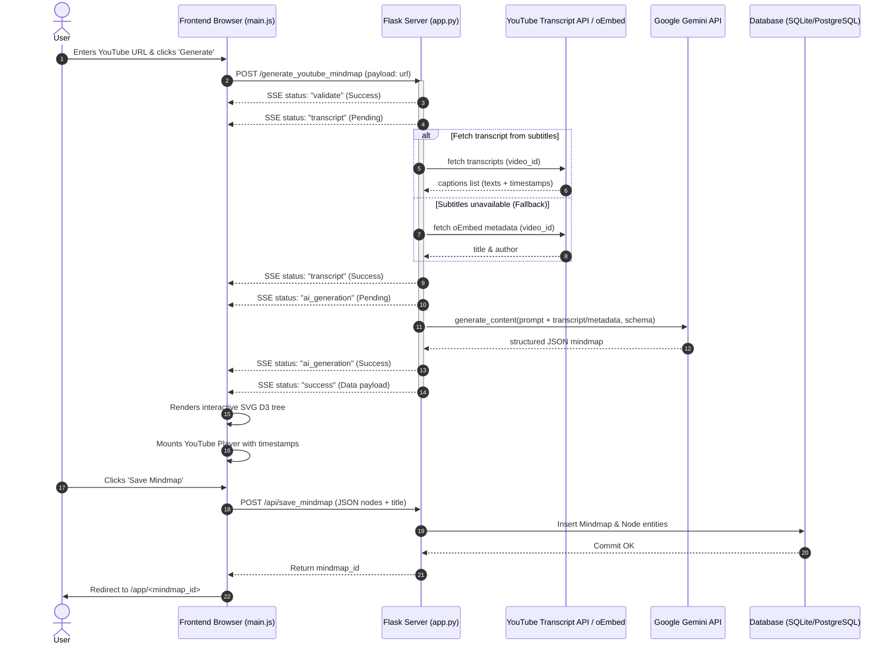
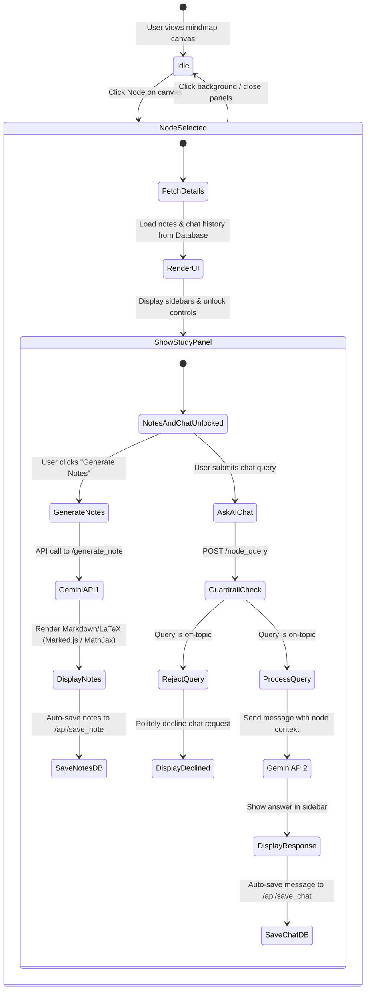
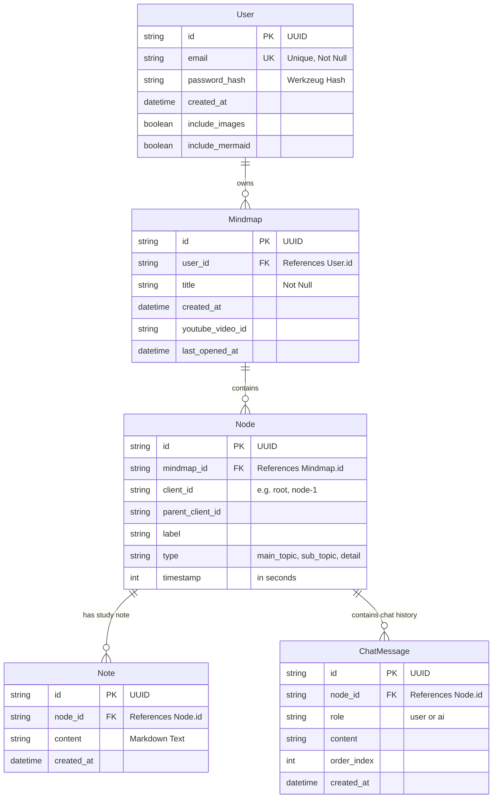

# MindMap.AI ✦ Intelligent Knowledge Synthesis

[](https://www.python.org/)
[](https://flask.palletsprojects.com/)
[](https://ai.google.dev/)
[](https://d3js.org/)

**MindMap.AI** is a premium, AI-driven knowledge synthesis and visualization application. It is designed to transform dense academic syllabi, complex documentation, or lengthy text blocks into intuitive, hierarchical mind maps. Combining state-of-the-art Large Language Models (LLMs) with a high-performance interactive client canvas, MindMap.AI bridges the gap between raw data ingestion and structured visual learning.

---

## ✦ System Component Architecture

The system follows a modern decoupled architecture where the visual canvas is rendered on the client browser dynamically from JSON data streams compiled by the Flask backend server.

```mermaid
graph TB
    subgraph Client ["Client Layer (Frontend Browser)"]
        UI["HTML5 / CSS3 (Glassmorphism UI)"]
        D3["D3.js (Canvas & Interactive Tree)"]
        Math["MathJax (LaTeX Renderer)"]
        Marked["Marked.js (Markdown Parser)"]
        YTPlayer["YouTube IFrame Player API"]
    end

    subgraph Server ["Application Server (Flask Backend)"]
        Flask["Flask Web App (app.py)"]
        AuthMgr["Flask-Login / Authlib"]
        ORM["SQLAlchemy ORM"]
        YTTranscript["YouTubeTranscriptApi"]
        GeminiSDK["Google GenAI Client"]
    end

    database DB[("SQLite/PostgreSQL DB")]

    subgraph External ["External Services"]
        GoogleOAuth["Google OAuth 2.0 Server"]
        GeminiAPI["Google Gemini AI API"]
        YToembed["YouTube OEMbed Service"]
    end

    UI --> D3
    UI --> Marked
    UI --> Math
    UI --> YTPlayer

    UI <-->|HTTPS / AJAX / SSE| Flask
    Flask --> AuthMgr
    Flask --> ORM
    Flask --> YTTranscript
    Flask --> GeminiSDK

    ORM --> DB
    AuthMgr <--> GoogleOAuth
    GeminiSDK <--> GeminiAPI
    YTTranscript <--> YToembed
```

---

## ✦ Key Features & Technical Workflows

### 1. One-Click Cognitive Mapping (Syllabus/Text)
*   **Pipeline Flow**: Upon receiving syllabus text from [templates/dashboard.html](file:///d:/Mind-Map/templates/dashboard.html), the backend initiates a structured prompt mapping sequence.
*   **LLM Inference**: The prompt requests Google Gemini to categorize text content into **Main Topics** (modules), **Sub-Topics** (concepts), and **Granular Details** (specifics).
*   **Output Control**: It enforces a strict JSON schema where nodes correctly link to parent node identifiers, with root nodes referencing the main `"title"`.
*   **Model Fallback Strategy**: The server queries the primary model `gemini-3.1-flash-lite`. If it encounters a rate limit or service unavailability (HTTP 503), it seamlessly falls back to `gemini-2.5-flash-lite` to ensure high availability.

### 2. YouTube Video Ingestion & SSE Streaming Pipeline
*   **Extraction & Validation**: The backend extracts the YouTube Video ID from incoming URLs using regex pattern matching.
*   **Streaming Server-Sent Events (SSE)**: To support long-running ingestion operations, the endpoint `/generate_youtube_mindmap` yields real-time updates as chunked SSE EventStreams:
    1.  `validate`: Checks link formatting.
    2.  `transcript`: Starts downloading subtitle transcripts.
    3.  `ai_generation`: Starts prompt processing using LLM models.
    4.  `success`: Returns the fully structured mindmap JSON.
*   **Metadata Fallback**: If subtitles are disabled or unavailable, the backend queries the YouTube oEmbed API to fetch the video's title and creator name, then instructs Gemini to synthesize a theoretical structure based on that subject matter.
*   **Timestamp Synchronization**: For transcripts containing subtitles, Gemini identifies when specific sub-topics begin. It extracts those `[MM:SS]` time markers, calculates the total offset in seconds, and attaches them to the respective child node.



### 3. Interactive Canvas (D3.js v7 Rendering Engine)
Implemented in [static/js/main.js](file:///d:/Mind-Map/static/js/main.js), the canvas provides an advanced navigation interface:
*   **D3 Tree Layout**: Translates hierarchical structures into hierarchical nodes.
*   **NotebookLM-Style Collision Avoidance**: Integrates custom radial padding to eliminate label collisions.
*   **Interactive Controls**:
    *   **Expand/Collapse Transitions**: Clicking on a parent node toggles the visibility of its sub-branches, animated smoothly using SVG transitions.
    *   **Zoom & Pan bounds**: D3-zoom limits minimum/maximum zoom scale to prevent elements from escaping the viewport bounds.
    *   **Fit to View**: Rescales the camera projection to show the entire structure centered on the canvas.

### 4. Interactive Study Sidebar & Ask AI Chat Guardrails
When a node is selected, a context-bound workspace slides out to offer two modes:
*   **Detailed Study Notes**: Generates in-depth Markdown summaries. Users can customize options inside settings:
    *   `include_images`: Instructs the LLM to search for and inject topic-appropriate stock diagrams using Unsplash API placeholders.
    *   `include_mermaid`: Instructs the LLM to write syntax-correct flowchart diagrams using `mermaid.js` inside markdown blocks.
    *   The frontend renders these nodes using `Marked.js` for Markdown, `MathJax v3` for mathematical LaTeX expressions, and initiates a local Mermaid parser.
*   **Contextual Ask AI Chat**: A chat interface enables direct conversation with the topic node. To prevent abuse, the prompt sets strict **Guardrail Rules**:
    *   Answers must be relevant only to the active node topic and its parent context.
    *   If the user's query is off-topic, unrelated, or attempts to prompt-inject or override instructions, the model politely declines and prompts the user to focus back on the node.
    *   All messages are saved to the database.



### 5. Multi-Auth & User Security Settings
*   **Local Accounts**: Secured with `Flask-Login` session management. Passwords are encrypted with SHA-256 using `werkzeug.security`'s `generate_password_hash` and `check_password_hash`.
*   **Google OAuth 2.0**: Implemented via `Authlib` to execute redirect Handshakes, exchanging Authorization Codes for Profile Tokens (`openid email profile` scopes).
*   **Session Persistence**: Flask sessions are marked permanent and scheduled with a lifetime of 30 days.

---

## ✦ Database Entity Relationship Diagram (ERD)

Database tables are managed using `SQLAlchemy` ORM. The relational models map user accounts, mindmap instances, hierarchical nodes, notes content, and node chat history.



---

## ✦ Technical API Endpoints Reference

The backend app exposing routes inside [app.py](file:///d:/Mind-Map/app.py) handles auth, mindmap creation, note generations, and chats.

| Route | Method | Authentication | Payload Schema | Response / Description |
| :--- | :--- | :--- | :--- | :--- |
| **Authentication & Profile** | | | | |
| `/` | `GET` | None | None | Renders landing page containing user register count. |
| `/api/signup` | `POST` | None | `{ "email": "...", "password": "..." }` | Standard credentials signup with validation checks. |
| `/api/login` | `POST` | None | `{ "email": "...", "password": "..." }` | Standard credentials login. Returns email on success. |
| `/api/logout` | `POST` | Required | None | Logs out current session. |
| `/login/google` | `GET` | None | None | Initiates redirection to Google OAuth server. |
| `/auth/google/callback` | `GET` | None | None | Callback handler for Google OAuth token exchange. |
| `/api/user` | `GET` | None | None | Checks current active user login state. |
| `/api/user/settings` | `GET` / `POST` | Required | `{ "include_images": bool, "include_mermaid": bool }` | Manages AI generated study note configurations. |
| **Mindmap Operations** | | | | |
| `/dashboard` | `GET` | Required | None | Renders dashboard workspace view. |
| `/app/<mindmap_id>` | `GET` | Required | None | Loads the main D3 interactive mindmap screen. |
| `/generate_mindmap` | `POST` | Required | `{ "syllabus": "..." }` | Analyzes syllabus text and returns structured JSON tree. |
| `/generate_youtube_mindmap` | `POST` | Required | `{ "url": "..." }` | Streaming SSE endpoint fetching transcript, prompting Gemini models. |
| `/api/save_mindmap` | `POST` | Required | `{ "title": "...", "nodes": [...], "youtube_video_id": "..." }` | Saves mindmap tree nodes. Returns `mindmap_id`. |
| `/api/get_mindmaps` | `GET` | Required | None | Returns a list of all mindmaps belonging to the user. |
| `/api/load_mindmap/<mindmap_id>` | `GET` | Required | None | Returns mindmap metadata and nodes from database. |
| `/api/rename_mindmap/<mindmap_id>`| `PUT` | Required | `{ "title": "..." }` | Renames the target mindmap document. |
| `/api/delete_mindmap/<mindmap_id>`| `DELETE`| Required | None | Deletes the mindmap and all dependent nodes, chats, notes. |
| **Notes & AI Chat** | | | | |
| `/generate_note` | `POST` | Required | `{ "topic": "...", "context": "..." }` | Queries Gemini AI to write markdown notes. |
| `/api/save_note` | `POST` | Required | `{ "mindmap_id": "...", "client_id": "...", "content": "..." }` | Persists user/AI custom notes text inside database. |
| `/api/get_note` | `POST` | Required | `{ "mindmap_id": "...", "client_id": "..." }` | Fetches the saved note content of the target node. |
| `/node_query` | `POST` | Required | `{ "node_label": "...", "context": "...", "query": "..." }` | Contextual Ask AI query with strict relevance guardrails. |
| `/api/save_chat` | `POST` | Required | `{ "mindmap_id": "...", "client_id": "...", "role": "user/ai", "content": "..." }` | Appends a chat message to the node database. |
| `/api/get_chat` | `POST` | Required | `{ "mindmap_id": "...", "client_id": "..." }` | Retrieves the sorted sequence chat history. |

---

## 🚀 Local Development Setup & Config

### Prerequisites
*   Python 3.9 or higher.
*   [Google Gemini API Key](https://aistudio.google.com/app/apikey).
*   Google Cloud Console Project configured with OAuth 2.0 Web Client credentials (for Google login integration).

### Environment Configuration
Create a `.env` file in the root directory:
```env
# Flask Settings
SECRET_KEY=super_secret_session_key_here
FLASK_DEBUG=True
FLASK_RUN_HOST=127.0.0.1

# AI Integrations
GEMINI_API_KEY=AIzaSyYourGeminiApiKeyHere

# Databases (SQLite for local development, Postgres/Neon for production)
DATABASE_URL=sqlite:///mindmap.db

# Google OAuth 2.0 Credentials
GOOGLE_CLIENT_ID=your_google_client_id.apps.googleusercontent.com
GOOGLE_CLIENT_SECRET=GOCSPX-your_google_client_secret
```

### Installation Steps

1.  **Clone the Repository**
    ```bash
    git clone https://github.com/yourusername/Mind-Map.git
    cd Mind-Map
    ```

2.  **Install Dependencies**
    Using standard Python `pip`:
    ```bash
    pip install -r requirements.txt
    ```
    Or utilizing `uv` for faster installation:
    ```bash
    uv pip install -r requirements.txt
    ```

3.  **Database Initializations & Migrations**
    The database models will automatically set up SQLite schemas inside `mindmap.db` when the application starts. An integrated migration helper in [app.py](file:///d:/Mind-Map/app.py) checks if columns such as `youtube_video_id`, `timestamp`, or settings are present and runs `ALTER TABLE` statements dynamically if missing:
    ```bash
    python app.py
    ```


---

## 🤝 Contributing

We welcome contributions from the developer community! To contribute:
1.  Fork the repository and clone it locally.
2.  Create your development feature branch: `git checkout -b feature/AmazingFeature`.
3.  Commit your updates following standard semantic conventions: `git commit -m 'feat: Add some AmazingFeature'`.
4.  Push changes: `git push origin feature/AmazingFeature`.
5.  Submit a Pull Request for review.

---

<p align="center">
  Built with ❤️ by Debmalya
</p>
