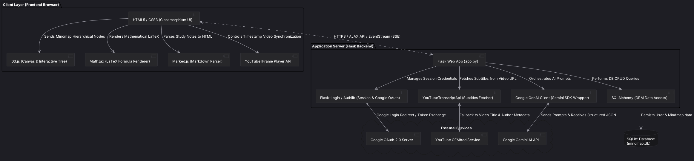
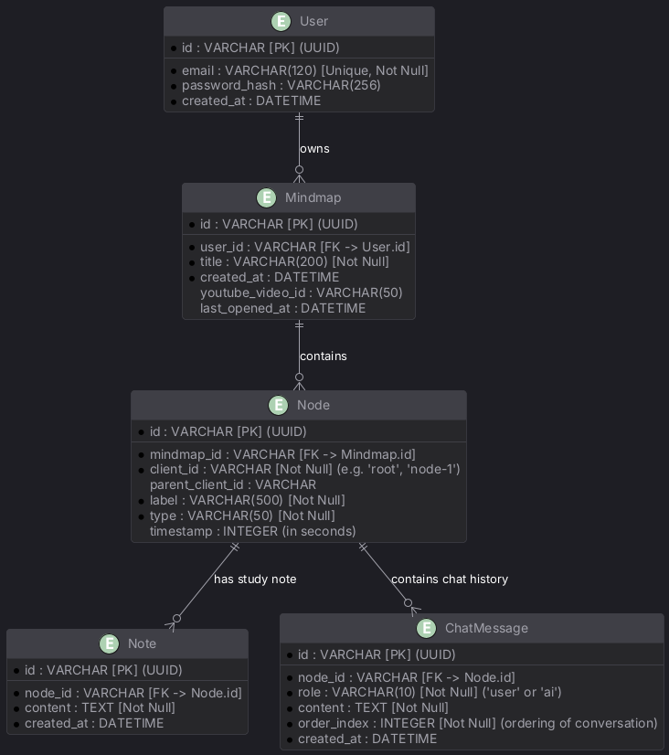
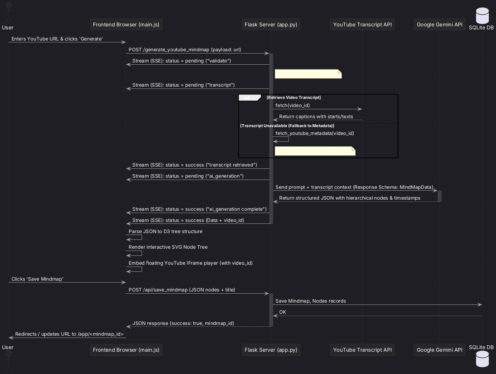
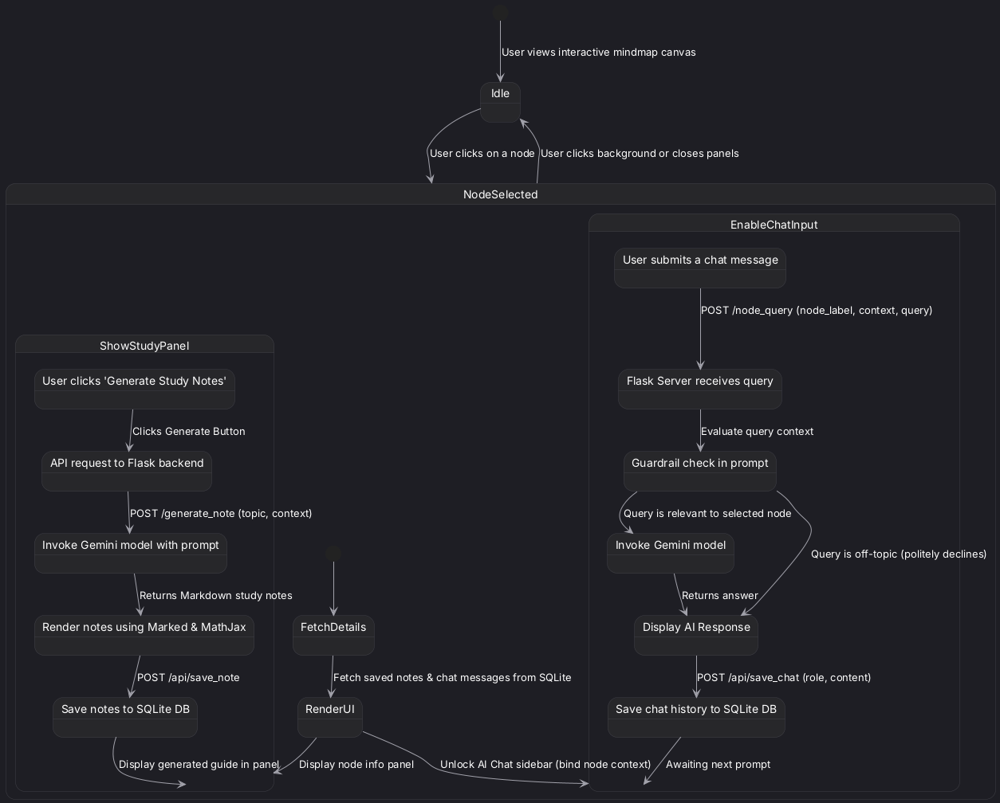

# MindMap.AI — System Architecture & Flows Diagrams

This document contains multiple PlantUML diagrams representing the architecture, database models, core workflows, and system state behaviors of the **MindMap.AI** application. 

You can copy and paste the PlantUML syntax below into any PlantUML editor/viewer (such as [PlantText](https://www.planttext.com/) or the VS Code PlantUML extension) to render the visual diagrams.

---

## 1. System Component Architecture
This component diagram shows the overall modular structure of MindMap.AI, illustrating how the frontend UI and visual engines communicate with the Flask backend, SQLite database, and external Google APIs.

---

## 2. Database Entity Relationship Diagram (ERD)
This diagram models the backend database entities managed through SQLAlchemy ORM, including relationships, tables, fields, and constraints.

---

## 3. YouTube Mindmap Generation Flow (Sequence Diagram)
This sequence diagram demonstrates the streaming pipeline when a user submits a YouTube video link to generate a mindmap. It visualizes the step-by-step Server-Sent Events (SSE) updates pushed to the client browser during transcription and Gemini analysis.

---

## 4. Interactive Node Detail Panel & Study Assistant Flow (State / Activity)
This diagram illustrates the state transitions when a user interacts with nodes on the canvas. It details how the contextual study assistant enforces prompt guardrails to prevent off-topic questions, and how study notes are generated and stored.

